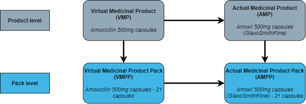

<script>
  $(document).ready(function() {
    $('#TOC').prepend('<div></div>');
  });
  
  $(document).ready(function() {
    $('#header').prepend('');
  });
</script>

<html lang="en">

```{r setup, include=FALSE}

# set code chunk options to disable echo by default
knitr::opts_chunk$set(echo = FALSE,
                      warning = FALSE,
                      message = FALSE)


```

<main>

# Background Information and Methodology {.toc-ignore}
  
##  June 2023 {.toc-ignore}

---
  
## 1 Background information

Prescription Cost Analysis (PCA) shows the total volume and cost for drugs, dressings, appliances, and medical devices that have been dispensed in the community in England. These statistics are designed to be able to provide the total number of prescription items and spend for any individual product, or at any level of the British National Formulary (BNF) hierarchy. For example, for Paracetamol 500mg tablets, or collections of products such as antibacterial drugs, antidepressant drugs, or dressings.

Prescription data is a long-standing administrative source of data that has been used by commissioners, providers, government, academia, industry, and media to inform local and national policy, in academic research, to monitor medicine uptake, and allow public scrutiny of prescribing habits. It is collected by the NHS Business Services Authority (NHSBSA) for the operational purpose of reimbursing and remunerating dispensing contractors for the costs of supplying drugs and devices, along with essential and advanced services, to NHS patients. The data that forms the basis of these statistics is collected as a by-product of this process.

### 1.1 How prescription data is collected

Data is collected from the submission of prescriptions by dispensing contractors to the NHSBSA. These prescriptions can be issued by GPs and other authorised prescribers such as nurses, dentists, and allied health professionals. Prescriptions that are issued by hospitals can also be dispensed in the community and submitted for reimbursement. Prescriptions that are issued in hospitals and fulfilled by the hospital pharmacy or dispensary are not included in this data.
Prescriptions can be issued as either a paper form or as an electronic message using the Electronic Prescription Service (EPS). EPS prescriptions make up most of prescribing and dispensing activity carried out in England, accounting for 88%<sup>1</sup>   of all prescriptions dispensed in England during 2021. EPS messages are submitted by the dispensing contractor once the prescription has been fulfilled and issued to the patient. The message is initially sent to the [NHS Spine](https://digital.nhs.uk/services/spine), maintained by NHS Digital, and then sent to the NHSBSA for processing. Paper prescriptions are compiled by the dispensing contractor and sent to the NHSBSA at the end of each month by secure courier. These paper prescriptions are then scanned and transformed into digital images, which are passed through intelligent character recognition (ICR) to extract the relevant data from them. Most paper forms go through ICR without any manual intervention. However, there are cases where operator intervention is required to accurately capture information from the prescription form. This manual intervention can be required for many reasons, such as if a form is handwritten or information is obscured by a pharmacy stamp.

<small><sup>1</sup> Source – NHSBSA Enterprise Data Warehouse.</small>aaa

After this processing for the reimbursement and remuneration of dispensing contractors, data is extracted from the NHSBSA transactional systems alongside data from the NHSBSA drug and organisational databases and loaded in to the NHSBSA Enterprise Data Warehouse (EDW). During this extract, load and transform (ELT) process a series of business logic is applied to the data to make it easier to use and more useful than if it were to be kept in its raw form. The EDW is the source used by many of our reporting systems and data extracts, including ePACT2, eDEN, eOPS, the English Prescribing Dataset (EPD), and Official Statistics publications.

### 1.2 Drug data held by the NHSBSA

The NHSBSA has a single drug database  that is used for both the reimbursement and reporting of drugs, appliances, and medical devices. This database is called Common Drug Reference (CDR) and holds all drug related information, including BNF classification, SNOMED CT, price and much more. This database is also the basis for the [NHS Dictionary of Medicines and Devices (DM+D)](https://www.nhsbsa.nhs.uk/pharmacies-gp-practices-and-appliance-contractors/dictionary-medicines-and-devices-dmd), which the NHSBSA maintain with support from NHS Digital. In these statistics we use the BNF, preparation class, and SNOMED CT classifications for drugs, appliances, and medical devices.

Drugs are held on CDR at an individual pack level. For example, Paracetamol 500mg tablets 16 pack and Paracetamol 500mg tablets 32 pack have separate entries in the database, along with separate entries for each supplier of the pack and any proprietary versions. This data model uses the concepts of Virtual Medicinal Products/Packs (VMPs/VMPPs) and Actual Medicinal Products/Packs (AMPs/AMPPs). Figure 1 gives the data model used in CDR and DM+D.

```{r echo=FALSE, out.width = "75%", fig.alt="Figure 1: DM+D data model"}

```

*Figure 1: DM+D data model*

Definitions of VMPs/AMPs and VMPPs/AMPPs are given in the glossary of terms included in this document.

The NHSBSA holds drug and prescription data at a pack level and uses this information for the correct reimbursement of dispensing contractors. However, the most granular data that we release in our reporting systems and other data outputs, including these statistics, is at a product level.

#### 1.2.1 SNOMED CT

Systematised Nomenclature of Medicine Clinical Terms (SNOMED CT) is a clinical vocabulary that is used in the context of electronic health records that makes exchanging information between clinical IT systems easier, safer, and more accurate. The SNOMED CT UK Drug Extension is derived from NHS DM+D and includes all concept classes such as VMP/AMP and VMPP/AMPP. This means that each VMP, AMP, VMPP, and AMPP are assigned a unique SNOMED code. In these statistics we display the product level VMP/AMP SNOMED code.

The SNOMED CT UK Drug Extension is updated and published every four weeks. You can see more information about SNOMED CT and the UK Drug Extension on the [NHS Digital website](https://digital.nhs.uk/services/terminology-and-classifications/snomed-ct).

#### 1.2.2 Preparation class

The NHSBSA specifies and maintains the preparation classes of drugs, appliances, and medical devices to more easily distinguish between generic, proprietary, and appliance products. A product can be classified in one of five ways, as in the following example:

- Class 1 – drugs prescribed and available generically for example, Amoxicillin 500mg capsules
- Class 2 – drugs prescribed generically but only available as a proprietary product for example, Oxycodone 15mg modified-release tablets
-	Class 3 – drugs prescribed and dispensed by proprietary brand name for example, OxyContin 15mg modified-release tablets
-	Class 4 – dressings, appliances, and medical devices for example, FastClix lancets 0.3mm/30gauge.
-	Class 5 – drugs prescribed generically with a named supplier for example, Amoxicillin 500mg capsules (A A H Pharmaceuticals Ltd)

It should be noted that this preparation class is held at the product level in CDR and VMPs and AMPs can only hold certain classes. A VMP can only have a class of 1, 2, or 4 and an AMP can only hold a class of 3, 4, or 5. The classes of a VMP’s child AMPs is what determines the preparation class of the VMP.

If a VMP has any class 5 child AMPs, then that VMP is a preparation class 1 product. If a VMP has only class 3 child AMPs, then that VMP is a preparation class 2 product. 

#### 1.2.3 British National Formulary (BNF) hierarchy

These statistics use the therapeutic classifications defined in the BNF to group medicines together based on their primary therapeutic indication. The NHSBSA uses and maintains the classification system of the BNF implemented prior to the release of edition 70, including the six pseudo BNF chapters (18 to 23) created by NHS Prescription Services used to classify products that fall outside of chapters 1 to 15. Most of these presentations held in these pseudo chapters are dressings, appliances, and medical devices. Every January the NHSBSA updates the classification of drugs within the BNF hierarchy which may involve some drugs changing BNF codes and moving within the hierarchy.
The BNF has multiple levels, in descending order from the largest grouping to smallest they are chapter, section, paragraph, sub-paragraph, chemical substance, product, and individual presentation. Presentations in chapters 20 to 23 do not have assigned BNF paragraphs, sub-paragraphs, chemical substances, or products.

#### 1.2.4 Drug Tariff categories

Drugs that are listed in Part VIIIA of the Drug Tariff for England and Wales are given one of three categories:

-	Category M – these are drugs that are readily available as generic. Category M prices are calculated by the Department of Health and Social Care (DHSC) based on information submitted by manufacturers and is the primary price adjustment mechanism to ensure delivery of the retained margin guaranteed as part of the Community Pharmacy Contractual Framework (CPCF). 
-	Category A – these drugs are also readily available as generic. Category A prices are calculated by DHSC and based on a weighted average of the list prices from 2 named wholesalers and 2 generic manufacturers. These manufacturers and suppliers currently are: AAH Pharmaceuticals Ltd, Alliance Healthcare (Distribution) Ltd, Teva UK Ltd, and Accord Healthcare Ltd.
-	Category C – these are drugs that are not readily available as generic. Category C prices are based upon one particular product, manufacturer, or sometimes supplier. Most of these drugs are preparation class 2, and in turn most class 2 preparation drugs are also category C.

In instances where dispensing contractors are unable to purchase products at, or below, the prices set out in the Drug Tariff due to supply shortages or other issues DHSC may grant a price concession. A concession is calculated using information derived from manufacturers and wholesalers, can be given for products listed in Parts VIIIA or VIIIB of the Drug Tariff, and are only applicable to the months in which they are granted.

## 2 Methodology

In December 2020 the NHSBSA held a public consultation on changing the methodology used in the PCA annual National Statistics and expanding their content. Following this consultation, we have changed the underlying methodology used to distribute prescription items with a preparation class of 2 amongst their proprietary equivalents. After the conclusion of the public consultation and during initial investigations into expanding the content of the statistics, we discovered that to accommodate the inclusion of additional drug classifications, such as SNOMED code, we would also have to change the aggregation of preparation class 5 items under their preparation class 1 equivalents.
Generic (unbranded) prescribing is encouraged, and many drugs are now prescribed this way even when they are not available in generic form. The methodology that we use in these statistics is intended to give an estimation of the actual product that has been dispensed to a patient for preparation class 2 drugs. This is not possible for preparation class 1 drugs.

### 2.1 Changes to the methodology

#### 2.1.1 Preparation class 1 drugs

In previous releases of PCA, items that were prescribed generically with a supplier listed (preparation class 5) were aggregated under their preparation class 1 equivalents. This was done as class 5 items share the same BNF code as their class 1 equivalents, and for all intents and purposes are truly generic drugs. 

*Table 1: Example data at presentation level as previously released*

```{r echo=FALSE}

# Creates a data frame with the example data
Paracetamol_example_data <- data.frame(
  `BNF Name` = "Paracetamol 500mg tablets",
  `BNF Code` = "0407010H0AAAMAM",
  `Preparation Class` = "01",
  `Total Items` = "12,000,000",
  check.names = FALSE
)

# Displays the table using kable
knitr::kable(Paracetamol_example_data) |> kableExtra::kable_styling()
```
To accommodate the inclusion of SNOMED drug codes, preparation class 5 items will now be represented in the data with their own records in both the SNOMED level and BNF presentation level summary tables. 

*Table 2: Example data at presentation level under new methodology - may not be representative of most recent data*

```{r echo=FALSE}

#Creates a data frame with the example data
example2_data <- data.frame(
  `BNF Name` = c("Paracetamol 500mg tablets", "Paracetamol 500mg tablets"),
  `BNF Code` = c("0407010H0AAAMAM", "0407010H0AAAMAM"),
  `Preparation Class` = c("01", "05"),
  `Total items` = c("11,000,000", "1,000,000"),
  check.names = FALSE
)

# Display the table using kable
knitr::kable(example2_data) |> kableExtra::kable_styling()
```

#### 2.1.2 Preparation class 2 drugs

Previously, preparation class 2 items were apportioned amongst their proprietary equivalents based on the volume of prescribing that these proprietary drugs had. This was done as way to reflect real world dispensing more accurately, as the NHSBSA does not capture the actual product that was dispensed to a patient. We now use further data already captured as part of normal prescription processing to determine the proprietary product that data should be displayed against. Please note, this methodology is still an approximation of the product that has been dispensed.

##### **2.1.2.1 Preparation class 2 drug with a single class 3 equivalent – one-to-one mapping**

All items and costs that have been prescribed generically will be reported against the proprietary presentation. However, these items and costs will be disaggregated across the preparation class of the prescribed item to allow users to compare ratios of generic and proprietary prescribing. 
For example, some medications have a prescribed preparation class of 2, indicating that their generic form was prescribed. However, they may only have one proprietary equivalent in class 3. This means that while the generic version can be prescribed, it is only available to dispense to patients at the proprietary equivalent. Therefore, all data in these statistics is displayed against the record for the proprietary equivalent, and items prescribed as the generic version are displayed separately to those prescribed as the proprietary equivalent.

##### 2.1.2.2 **Preparation class 2 drug with multiple class 3 equivalents – one-to-many mapping**

In these cases, we will use the reimbursement price as held within our database (CDR) for that month to match the cost that we have reimbursed the dispensing contractor. Where a unique relationship can be determined all items and costs will be attributed to the matched proprietary drug. 

For example, Beclometasone 100micrograms/dose inhaler CFC free is a preparation class 2 drug with four class 3 equivalents. This means that although Beclometasone 100micrograms/dose inhaler CFC free can be prescribed generically, it is only available to dispense to patients as one of its proprietary equivalents. Each of these class 3 drugs has a different price, and therefore we can use this to help distinguish the actual product that we reimbursed the dispensing contractor for.

*Table 3: Example of reimbursement prices with unique relationship*

```{r echo=FALSE}

# Create a data frame of Example reimbursement data
Example_reimbursement_data <- data.frame(
  "BNF Name" = c("Qvar 100 inhaler", "Clenil Modulite 100micrograms/dose inhaler", "Kelhale 100micrograms/dose inhaler", "Soprobec 100micrograms/dose inhaler"),
  "BNF Code" = c("0302000C0BJABBF", "0302000C0BPABBF", "0302000C0BSABBF", "0302000C0BTACBF"),
  "Preparation class" = c("03", "03", "03", "03"),
  "Reimbursement price (p)" = c(1721, 742, 520, 557),
  check.names = FALSE
)

# Display the table using kable
kable(Example_reimbursement_data) |> kableExtra::kable_styling()

```

*Table 4: Example data for preparation class 2 drug with unique price relationship*

```{r echo=FALSE}

# Create a data frame with the example preparation class data
example_preparation_class_data <- data.frame(
  "BNF Name" = c("Qvar 100 inhaler", "Qvar 100 inhaler", "Clenil Modulite 100micrograms/dose inhaler", "Clenil Modulite 100micrograms/dose inhaler", "Kelhale 100micrograms/dose inhaler", "Kelhale 100micrograms/dose inhaler", "Soprobec 100micrograms/dose inhaler", "Soprobec 100micrograms/dose inhaler"),
  "BNF Code" = c("0302000C0BJABBF", "0302000C0BJABBF", "0302000C0BPABBF", "0302000C0BPABBF", "0302000C0BSABBF", "0302000C0BSABBF", "0302000C0BTACBF", "0302000C0BTACBF"),
  "Preparation class" = c("03", "03", "03", "03", "03", "03", "03", "03"),
  "Prescribed Preparation Class" = c("02", "03", "02", "03", "02", "03", "02", "03"),
  "Total Items" = c("50,000", "650,000", "400,000", "1,600,000", "150", "19,850", "2,500", "297,500"),
  check.names = FALSE
)

# Display the table using kable
kable(example_preparation_class_data) |> kableExtra::kable_styling()

```

Sometimes a unique relationship between prices cannot be established, where more than one proprietary equivalent has a matching reimbursement price for that month. In these cases, we use the endorsement field present within the EPS message to try to determine which proprietary class 3 drug was dispensed.
For example, Venlafaxine 37.5mg modified-release capsules is a preparation class 2 drug with three class 3 equivalents. Two of these equivalents have the same price, and therefore we cannot use the price to reliably determine what drug has been dispensed to a patient. 

*Table 5: Example of reimbursement prices with non-unique relationship*

```{r echo = FALSE}

# Create a data frame with the given data
data <- data.frame(
  "BNF Name" = c("Venlablue XL 37.5mg capsules", "Vencarm XL 37.5mg capsules", "Majoven XL 37.5mg capsules"),
  "BNF Code" = c("0403040W0BRACAS", "0403040W0CCAAAS", "0403040W0CFAAAS"),
  "Preparation class" = c("03", "03", "03"),
  "Reimbursement price (p)" = c(525, 330, 525),
  check.names = FALSE
)

# Display the table using kable
kable(data) |> kableExtra::kable_styling()


```

Here we will use the endorsement field within the EPS message, if it has been completed by the dispensing contractor, to help determine what proprietary drug to attribute the items to. However, where it has not been possible to establish a relationship to a class 3 drug using the endorsement field, or in the case of paper prescriptions an EPS message does not exist, data will be reported against the record for the generic class 2 record.

*Table 6: Example data for preparation class 2 drug with non-unique price relationship*

```{r echo = FALSE}
# Create a data frame with the given Example preparation class 2 data
Example_preparation_class_2_data <- data.frame(
  "BNF Name" = c("Venlablue XL 37.5mg capsules", "Vencarm XL 37.5mg capsules", "Majoven XL 37.5mg capsules"),
  "BNF Code" = c("0403040W0BRACAS", "0403040W0CCAAAS", "0403040W0CFAAAS"),
  "Preparation class" = c("03", "03", "03"),
  "Reimbursement price (p)" = c(525, 330, 525),
  check.names = FALSE
)

# Display the table using kable
kable(Example_preparation_class_2_data) |> kableExtra::kable_styling()
```

#### 2.1.3 Preparation class attribute

A drug can change preparation class during the period that data relates to. In previous releases of PCA, the preparation class of a product from the latest month it appeared in the data was used to classify the product for the whole period. For example, for calendar year data, if a drug changed from class 2 to class 1 in September and remained so until December, the preparation class in December would be used to represent all the data for the period.

We have now changed this so that when a product changes preparation class data is displayed against each preparation class. In the example given above there would be two records in the data, one for data from when the product was a class 2 drug, and one for when the product was a class 1 product. In many cases like this one, when the product was a class 2 it may have had a one-to-one relationship with a class 3 equivalent, or a unique price relationship. This will create a record that has a preparation class of 1 with proprietary class 3 equivalents that will have items that have been prescribed as a preparation class 2. This may be confusing for users.

For example, Melatonin 2mg modified-release tablets changed from a preparation class 2 to a class 1 drug in September 2020. This will cause items prescribed generically in September onwards to be displayed against the class 1 record, whilst items prescribed generically before September will be displayed against the class 3 equivalent.

*Table 7: Example data of a product that has changed preparation class during the period*

```{r echo = FALSE}
# Create a data frame with the given data
data <- data.frame(
  "BNF Name" = c("Melatonin 2mg modified-release tablets", "Circadin 2mg modified-release tablets", "Circadin 2mg modified-release tablets"),
  "BNF Code" = c("0401010ADAAAAAA", "0401010ADBBAAAA", "0401010ADBBAAAA"),
  "Preparation class" = c("01", "03", "03"),
  "Prescribed Preparation Class" = c("01", "02", "03"),
  "Total Items" = c("20,000", "200,000", "600,000"),
  check.names = FALSE
)

# Display the table using kable
kable(data) |> kableExtra::kable_styling()

```

### 2.2 Limitations
#### 2.2.1 Drug Tariff category C price concessions

In the rare event that the Department of Health and Social Care (DHSC) grants a price concession for a category C drug this can cause a mismatch between the reimbursement price paid to the dispensing contractor and the price held within CDR. In these cases, data will be attributed to the generic preparation class 2 record as no matching price for a proprietary class 3 can be found.

#### 2.2.2 Unspecified items with generic equivalents
There are a small number of items that appear within the data that are recorded as having an unspecified BNF presentation but with a generic equivalent that is not unspecified. This occurs in cases where the AMP record in CDR does not hold a BNF presentation or code, but the parent VMP does. 
 
## 3 Changes to this publication

As well as the changes described in the ‘Methodology’ section of this document, we have also expanded the content of the publication for this release to include further breakdowns and analyses.

### 3.1 Drug Breakdowns

We have included an additional table within the supporting summary tables that provides data at a more granular level, giving the SNOMED codes of drugs, appliances, and medical devices. In this table a single BNF presentation can have multiple SNOMED codes assigned to it. These SNOMED codes each relate to an individual VMP or AMP that hold the same BNF code. This is most often the case for preparation class 1 drugs and their preparation class 5 equivalents. This disaggregates data across the different suppliers of these generic drugs.

### 3.2 Geographical breakdowns

We have also included geographic breakdowns within the data for Integrated Care Boards (ICBs). ICBs are statutory NHS organisations which are responsible for developing a plan for meeting the health needs of the population, managing the NHS budget and arranging for the provision of health services in a geographical area. In these statistics the ICB given is that of the dispensing contractor and not the prescribing organisation. These geographies are taken from NHSBSA administrative records and relate to the commissioning of services for NHS patients, and not the physical location of a dispensing contractor, or the patient that has received the drug, appliance, or medical device.
Some dispensing contractors are distance selling pharmacies or ‘online’ pharmacies. These contractors are required by regulation to provide a national service to NHS patients. However, they are only associated with a single ICB in NHSBSA administrative records. In these cases, some ICBs may have higher than expected dispensing of products or of certain drugs or appliances due to the existence of a distance selling or specialist pharmacy within their boundary.
In these statistics we have used the ICB boundaries as of March 2023 and applied this throughout the year. Therefore, if a dispenser were to change ICB throughout the year, the dispenser’s ICB as of March 2023 would be used as their ICB for the entire period. 

### 3.3 Time periods

This publication has now transitioned from a calendar year to a financial year view. We will continue to provide a calendar year data file to allow users to draw comparisons in several ways. However, the statistical summary narrative and additional analysis tables will only relate to financial year information.

## 4 Strengths and limitations

### 4.1 Strengths 

The main strength of these statistics is the completeness of the dataset and accuracy of information captured during processing activities carried out by the NHSBSA. This dataset covers all prescribing that has been dispensed in the community in England, with consistency in the way data has been captured across the whole dataset. All the data has come from the same administrative source. This administrative data is required to be as accurate as possible as it is used for paying dispensing contractors for services provided to NHS patients.
Releasing data including SNOMED codes allows users to combine these statistics with other data sources that use SNOMED CT classifications, such as Secondary Care Medicines Data (SCMD) that is published on behalf of NHS England on the NHSBSA Open Data Portal (ODP).
The NHSBSA’s decision to transition to a single source of drug information in April 2020 also means that the accuracy of these statistics has increased, with known issues and limitations with the previous legacy system being eliminated. These limitations included presentations that were incorrectly listed as preparation class 1. This incorporates items previously captured as unspecified drugs now being captured correctly and an increase in the accuracy of capture of quantity information about prescribed drugs. Also due to the editorial policy of DM+D, there is now greater consistency in the naming of presentations.

### 4.2 Limitations

The NHSBSA is unable to determine the true actual medicinal product that is dispensed, and therefore uses the methodology stated above. This means that figures quoted in this publication for some presentations are estimations rather than true reflections of volumes of dispensing. We are also unable to determine the individual suppliers of generic presentations that are dispensed if the supplier is not listed as part of the prescribed order.
These statistics exclude prescriptions that were issued but not presented for dispensing and prescriptions that were not submitted to the NHSBSA for processing and reimbursement. Prescriptions issued and dispensed in prisons, hospitals and private prescriptions are also excluded.
Not all products that are dispensed are assigned a BNF code and are instead classified in these statistics as an ‘unspecified item’. In 2022/23 there were 420,000 items which were classified as unspecified, 0.04% of all prescription items dispensed.
The NHSBSA do not capture the clinical indication of a prescription and therefore do not know the reason why a prescription was issued, or the condition it is intended to treat. Many drugs have multiple uses, and although classified in the BNF by their primary therapeutic use may be issued to treat a condition outside of this. Due to this, these statistics may not give accurate estimations of prescribing to treat specific conditions. For example, some drugs that are classified as antidepressants are issued to treat migraine, chronic pain, myalgic encephalomyelitis (ME) and a range of other conditions. 

### 4.3 Uses of PCA

PCA serves a clear function and as such, does not satisfy all use cases. See our [Official Statistics guidance table](https://www.nhsbsa.nhs.uk/statistical-collections) for a short summary of the key criteria covered by PCA. To expand on the points outlined in that document, see the below summaries for suitable/unsuitable uses for PCA.

#### 4.3.1 PCA can be used for:

-	Obtaining a national view of costs and volumes for prescriptions dispensed in the community in England across the calendar year.
-	Analysis of cost and volume trends across various levels of the BNF hierarchy.
-	Allowing public scrutiny of national prescribing habits.
-	Monitoring uptake of new to market proprietary presentations.
-	Monitoring the proportion of prescriptions dispensed generically.

Additional data tables have also been supplied as part of the release which enable analysis of some key areas of interest.

#### 4.3.2 PCA cannot be used for:

-	Providing breakdowns for more granular geographies than ICB. 
-	Providing a final figure representative of the total cost to the NHS. The final cost measure used in this publication, net ingredient cost (NIC), does not consider all elements that contribute towards the final cost to the NHS, for example remuneration to contractors, discounts, advance payments, and patient charges. Additionally, the data only includes items prescribed in multiple health care settings including secondary care and subsequently dispensed in the community. Items issued and dispensed in secondary care are not included.
-	Viewing items dispensed outside of England. The PCA dataset is limited to a view of items dispensed only in the community in England, regardless of whether they were prescribed in England, Scotland, Wales, Northern Ireland, and State authorities such as Guernsey, Jersey, Alderney, and Isle of Man.
-	Viewing items and trends that have been prescribed. PCA uses a dispensing view, in which only items that English dispensing contractors including personally administered (PADM) claims submitted to the NHSBSA have been reimbursed for will be shown.
-	Investigating flu data. Flu vaccines that have been administered by a dispensing doctor or via PADM and submitted to the NHSBSA via FP10 will appear in PCA. This only accounts for a small amount of flu claims. Any vaccines administered via the pharmacy advanced flu service will not be available in PCA. 
-	Providing analysis of the method of dispensing. PCA National Statistics provides no distinction between community pharmacies, appliance contractors, dispensing doctors, or PADM accounts.

Users should note that it is only assumed that the items claimed for on the prescription forms are the same as those dispensed to patients. Whilst it would break the dispensing contractor terms of service to dispense another item (except in instances where a Serious Shortage Protocol is in place), the NHSBSA has no way of confirming this.

## 5 Revisions

Any revisions that we make to these statistics will be made in line with our [Revisions and Corrections policy](https://www.nhsbsa.nhs.uk/policies-and-procedures). Any significant errors that are identified within these statistics after their publication that would result in the contradiction of conclusions previously drawn from the data will be notified of prominently on our website and any other platforms that host these statistics, corrected as soon as possible, and communicated clearly to users and stakeholders.

## 6 Related statistics, comparability, and useful resources

NHSBSA releases Prescription Cost Analysis (PCA) – England, a publication with National Statistics designation. Similar releases are produced by the devolved administrations for Scotland, Wales, and Northern Ireland. There are numerous differences between these releases including in the way that data measures are collected and classified, the different structures of the health and social care systems in each country, and methodological differences. For these reasons, any comparisons made between PCA data produced by different devolved authorities should be treated with caution. However, the main measures of drug cost and volumes of items dispensed in the community are comparable across the different regions. Some differences that should be taken into consideration are:

1.	Whilst we release both calendar and financial year information for England, other devolved administrations use only financial year or calendar year for their annual publication.

2.	Users should be aware of differing naming conventions used between the devolved administrations. For the cost of items dispensed and reimbursed before deduction of any dispenser discount, England, and Wales both use the term ‘Net Ingredient Cost’ (or ‘NIC’), whereas Scotland use ‘Gross Ingredient Cost’, and Northern Ireland use ‘Ingredient Cost’. Similarly, for the cost of items dispensed and reimbursed after deduction of any dispenser discount, England use the term ‘Actual Cost’, whereas Scotland use ‘Net Ingredient Cost’. Wales and Northern Ireland do not report on these measures. Scotland use a further two reporting measures, ‘Gross Cost’ and ‘Total (Net) Cost’, which England do not report on.

3.	Each devolved administration produces statistics in a way that most effectively suits their needs. This includes grouping PCA with other similar publications in some cases. In particular, Wales does not release granular data for prescriptions that have been prescribed anywhere in the UK but dispensed in Wales only.

4.	England utilise a methodology outlined in the ‘Methodology’ section of this document, which is not utilised by any other devolved administration. This methodology does not impact national total comparisons between England and other devolved administrations but does impact comparisons made between some individual presentations at the lowest level granularity. 

5.	Broader differences amongst the health and social care system structures for each devolved administration exist that should be taken into consideration, such as the provision of free prescriptions.

### 6.1 UK Statistics

The versions of PCA released by the other devolved administrations of the UK can be found on their respective websites of the [Business Services Organisation](http://www.hscbusiness.hscni.net/services/3177.htm) in Northern Ireland, [Public Health Scotland](https://beta.isdscotland.org/find-publications-and-data/health-services/pharmacy-and-prescribing/dispenser-payments-and-prescription-cost-analysis/) in Scotland, and the [NHS Wales Shared Services Partnership](https://nwssp.nhs.wales/ourservices/primary-care-services/general-information/data-and-publications/prescription-cost-analysis/) in Wales.

### 6.2 Comparisons over time

We have provided the full back series of data that we have available to us at the NHSBSA from 2014 onwards to allow comparisons over time to be made more easily via our [Open Data Portal](https://opendata.nhsbsa.net/) (ODP). Data from a previous series of PCA released by NHS Digital is [available from 2004 to 2018.](https://digital.nhs.uk/data-and-information/publications/statistical/prescription-cost-analysis)

### 6.3 Dictionary of Medicines and Devices (DM+D)

The DM+D can be accessed via a web-based browser on the [NHSBSA website.](https://www.nhsbsa.nhs.uk/pharmacies-gp-practices-and-appliance-contractors/dictionary-medicines-and-devices-dmd) On the website are also the DM+D editorial policy and the data model of the database that feeds the browser. These are key resources in understanding the drug data that the NHSBSA holds.

### 6.4 NHSBSA Open Data Portal

The NHSBSA [Open Data Portal](https://opendata.nhsbsa.net/) is the platform where we host our open data products, including the most granular data tables released as part of these 

### 6.5 Code of Practice for Statistics

These statistics have been produced in compliance with the Code of Practice for Statistics. You can find more on the code of practice and its pillars, principles, and practices from the [UK Statistics Authority website.](https://code.statisticsauthority.gov.uk/the-code/)

## 7 Quality of the Statistics

We aim to provide users of this publication with an evidence-based assessment of its quality and the quality of the data from which it is produced. We do so to demonstrate our commitment to comply with the UK Statistics Authority’s (UKSA) Code of Practice for Statistics, particularly the pillar of Quality and its principles.

**Q1 Suitable data sources** – Statistics should be based on the most appropriate data to meet intended uses. The impact of any data limitations for use should be assessed, minimised, and explained.
**Q2 Sound methods** – Producers of statistics and data should use the best available methods and recognised standards and be open about their decisions.
**Q3 Assured quality** – Producers of statistics and data should explain clearly how they assure themselves that statistics and data are accurate, reliable, coherent, and timely.
This is an assessment of the quality of these statistics against the European standard for quality reporting and its dimensions specific to statistical outputs, particularly:

-	Relevance
-	Accuracy and reliability
-	Timeliness and punctuality
-	Accessibility
-	Coherence and comparability
These principles guide us and are complimented by the UKSA’s regulatory standard for the Quality Assurance of Administrative Data (QAAD). You can view our QAAD assessment of prescription data [on our website.](https://www.nhsbsa.nhs.uk/statistical-collections)

### 7.1 Relevance

**This dimension covers the degree to which the product meets user need in both coverage and content**

The PCA publication, released annually, summarises all prescription items dispensed in the community in England for the preceding financial and calendar years, highlighting high-level changes from previous years and providing the details for each item prescribed. These statistics are used to help inform and monitor the impact of policy relating to community pharmacy and prescribing practice. These statistics are also utilised by academic and applied health researchers, pharmacy contractors, and the pharmaceutical industry for a variety of reasons, from investigating public health to calculating uptake of branded medicines.

### 7.2 Accuracy and reliability

**This dimension covers the statistics proximity between an estimate and the unknown true value**

#### 7.2.1 Accuracy

These statistics are derived from data collected during processing activities carried out by the NHSBSA to reimburse dispensing contractors for providing services to NHS patients. Prescriptions are scanned and subject to rigorous automatic and manual validation processes to ensure accurate payments are made to dispensing contractors. Where electronic prescriptions are used the scope for manual intervention and input into data is reduced dramatically.
The figures used are collected as an essential part of the process of reimbursing dispensing contractors (mainly pharmacists and dispensing doctors) for medicines supplied. All prescriptions which are dispensed in England need to be submitted to the NHSBSA if the dispenser is to be reimbursed, and so coverage should be complete. Due to the manual processes involved in the processing of prescriptions there may be random inaccuracies in capturing prescription information which are then reflected in the data. NHS Prescription Services, a division of NHSBSA, internally quality assures the data that is captured from prescriptions to a 99.70% level via a statistically valid random sample of 50,000 items that are reprocessed monthly. The latest reported [Prescription Processing Information Accuracy](https://www.nhsbsa.nhs.uk/pharmacies-gp-practices-and-appliance-contractors/payments-and-pricing/how-we-process-prescriptions) from NHS Prescriptions services, which covers the 12 month period March 2022 to February 2023 is 99.91%. 

#### 7.2.2 Reliability
As there is a manual data entry element to this system then inevitably some small errors may occur in the data. The NHSBSA and NHS Prescription Services take measures to minimise these errors. This includes the presence of a permanent dedicated accuracy team within NHS Prescription services which provides feedback to operators around any errors identified to help prevent regular occurrence.

### 7.3 Timeliness and punctuality

**Timeliness refers to the time gap between publication and the reference period. Punctuality refers to the gap between planned and actual publication dates**


The PCA publication is published annually. The publication date is determined by the availability of the data, dependent on the completion of processing by NHS Prescription Services, allowing adequate time for the compilation and quality assurance of the publication. The data is usually available six weeks after the end of the month that the data relates to. In future releases the date of release will be scheduled for approximately two weeks from the date of data availability and will be announced in advance in line with our [statistical release calendar.](https://www.nhsbsa.nhs.uk/announcements/statistical-publication-calendar)

### 7.4 Accessibility and clarity

**Accessibility is the ease with which users can access the data, also reflecting the format in which the data are available and the availability of supporting information. Clarity refers to the quality and sufficiency of the metadata, illustrations, and accompanying advice**

The statistical summary narrative for this publication is presented as an HTML webpage, with supporting documentation released in PDF format. Summary data and additional analysis is presented in tables in Excel files, with the most granular tables available in XLSX format.

The most granular data released in these statistics are also available via an API in the [NHSBSA ODP](https://opendata.nhsbsa.net/).

### 7.5 Coherence and comparability

**Coherence is the degree to which data have been derived from different sources or methods but refer to the same topic or similar. Comparability is the degree to which data can be compared over time and domain**

The PCA publication contains data for all prescriptions that have been dispensed in the community in England. This differs to data provided in the [English Prescribing Dataset (EPD)](https://opendata.nhsbsa.net/dataset/english-prescribing-data-epd) which is also released by the NHSBSA as a monthly management information administrative data feed. EPD details prescription items that have been issued in England in a primary care setting, including those that were subsequently dispensed elsewhere in the UK. EPD is not released as an Official Statistic by the NHSBSA.

PCA and EPD serve different purposes and fulfil different criteria and user need. PCA data is a ‘dispensing’ view of prescription data, showing the ICB of the dispensing organisation and drugs that are most likely to have been dispensed. EPD is strictly a ‘prescribing’ view of prescription data, showing the prescribing organisation of items and the product that was written on the prescription form itself.

The inclusion of SNOMED codes within PCA data as detailed elsewhere in this document have improved the comparability of these statistics between other sources of drug information, such as secondary care.


#### 7.5.1 Comparisons over time

Changes to the figures displayed in these statistics over time should be interpreted in the context of the wider prescribing system, including the availability of medicines, release of new medicines and their costs, and changing national and regional prescribing guidelines.

These statistics use the BNF therapeutic classifications defined in the British National Formulary (BNF) using the classification system prior to BNF edition 70. Every January the NHSBSA updates the classification of drugs within the BNF hierarchy which may involve some drugs changing classification between years of PCA data. This data is therefore correct at the time of publication but may differ in the following year. The NHSBSA publishes the latest BNF information each year via its information systems. 


## 8 Glossary of terms used in these statistics

**Actual medicinal product (AMP)**

This is a product that has been made available by a supplier. This is a physical entity but is devoid of pack size information. For example, Panadol Advance 500mg tablets or Paracetamol 500mg tablets (A A H Pharmaceuticals).

**Virtual medicinal product (VMP)**

A VMP is an abstract concept representing the properties of one or more clinically equivalent Actual Medicinal Products (AMPs), where clinical is defined as relating to the course of a disease. For example, Paracetamol 500mg tablets.

**Chemical substance**

A chemical substance is the name of the main active ingredient in a drug. Appliances do not hold a true chemical substance. It is determined by the British National Formulary (BNF) for drugs, or the NHSBSA for appliances. For example, Amoxicillin.

**Cost**

In British pound sterling (GBP). The amount that would be paid using the basic price of the prescribed drug or appliance and the quantity prescribed, sometimes called 'Net Ingredient Cost' (NIC). The basic price is given either in the Drug Tariff or is determined from prices published by manufacturers, wholesalers, or suppliers. Basic price is set out in Parts VIII and IX of the Drug Tariff. For any drugs or appliances not in Part VIII, the price is usually taken from the manufacturer, wholesaler, or supplier of the product.

**Dispensed in the community**

When a prescription item is dispensed in the community this means that it has been dispensed by a community pharmacy, appliance contractor, dispensing doctor, or is a personally administered item.

**Dispensing contractor/dispenser**

A dispensing contractor or dispenser can be a community pharmacy or appliance contractor (a dispenser that specialises in dispensing dressing, appliances, and medical devices).
Prescriptions can also be dispensed by the dispensary of a dispensing practice or personally administered at a practice. Dispensing practices usually exist in more rural areas where the need for a dispenser is deemed necessary, but it is not deemed financially viable to establish a community pharmacy.

**Items**

The term Items refers to the number of times a product appears on a prescription form. Prescription forms include both paper prescriptions and electronic messages.

**Prescription/prescription form**

A prescription (also referenced as a prescription form) has two incarnations: a paper form, and an electronic prescription available via EPS. A paper prescription can hold up to a maximum of ten items. A single electronic prescription can hold a maximum of four items.

**Presentation**

A presentation is the name given to the specific type, strength, and formulation of a drug, or the specific type of an appliance. For example, Paracetamol 500mg tablets. A presentation can be either an actual medicinal product or a virtual medicinal product. For generic presentations, a single presentation can hold a VMP and many AMPs for each generic supplier of that product.

**Integrated Care Board (ICB)**

ICBs are statutory NHS organisations which are responsible for developing a plan for meeting the health needs of the population, managing the NHS budget and arranging for the provision of health services in a geographical area.

**Total Quantity**

This is the total quantity of a drug or appliance that was prescribed. This is calculated by multiplying Quantity by Items. For example, if 2 items of Amoxicillin 500mg capsules with a quantity of 28 were prescribed, total quantity will be 56.

## 9 Feedback and contact us
Feedback is important to us. We welcome any questions and comments relating to this document. Please quote ‘PCA – Background Information and Methodology Note’ in the subject title of any correspondence.

A [continuous feedback survey](`r config$stats_survey_link`) is available on the Prescription Cost Analysis web page that can be completed by users.

### 9.1 Contact us 

You can contact us by:

**Email**: nhsbsa.statistics@nhs.net

**You can write to us at:**

NHSBSA Statistics,

NHS Business Services Authority,

Stella House,

Goldcrest Way,

Newburn Riverside,

Newcastle upon Tyne,

NE15 8NY

**END**
</main>
