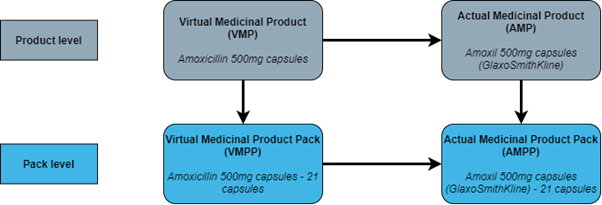

<script>
    $(document).ready(function() {
    $('#header').prepend('');
  });
</script>

<html lang="en">

```{r setup, include=FALSE}

# set code chunk options to disable echo by default
knitr::opts_chunk$set(echo = FALSE,
      warning = FALSE,
      message = FALSE)


```

<div class = "quartoheader", id = "fixed-header">
        <header class="nhsuk-header" role="banner">
    <div class="nhsuk-width-container nhsuk-header__container">
      <div class="nhsuk-header__logo nhsuk-header__logo--only">
        <a class="nhsuk-header__link" href="https://www.nhsbsa.nhs.uk/" aria-label="NHSBSA home" target="_blank">
          
        </a>
      </div>
    </div>
    </div>

<main>

# Background Information and Methodology {.toc-ignore}
 
## June 2025 {.toc-ignore}

---
 
## 1. Background information

Prescription Cost Analysis (PCA) shows the total volume and cost for drugs, dressings, appliances, and medical devices that have been dispensed in the community in England. These statistics are designed to provide the total number of prescription items and spend for any individual product, at any level of the British National Formulary (BNF) hierarchy. For example, for Paracetamol 500mg tablets, or collections of products such as antibacterial drugs, antidepressant drugs, or dressings.

Prescription data is collected by the NHS Business Services Authority (NHSBSA) for the operational purpose of reimbursing and remunerating dispensing contractors for the costs of supplying drugs and devices, and providing essential and advanced services, to NHS patients. The data that forms the basis of these statistics is collected as a by-product of this process. This data is also used by commissioners, providers, government, academia, industry, and media. It is used to monitor medicine uptake, to allow public scrutiny of prescribing habits, to inform local and national policy, and in academic research.

### 1.1. How prescription data is collected

Data is collected from the submission of prescriptions by dispensing contractors to the NHSBSA. These prescriptions are issued by GPs and other authorised prescribers such as nurses, dentists, and allied health professionals. Prescriptions that are issued by hospitals can also be dispensed in the community and submitted for reimbursement. Prescriptions that are issued in hospitals and fulfilled by the hospital pharmacy or dispensary are not included in this data.

Prescriptions can be issued as either a paper form or as an electronic message using the Electronic Prescription Service (EPS). EPS prescriptions make up most of prescribing and dispensing activity carried out in England, accounting for 89%<sup>1</sup> of all prescriptions dispensed in England during 2023/24. EPS messages are submitted by the dispensing contractor once the prescription has been fulfilled and issued to the patient. The message is initially sent to the [NHS Spine](https://digital.nhs.uk/services/spine), maintained by NHS Digital, and then sent to the NHSBSA for processing. 

Paper prescriptions are compiled by the dispensing contractor and sent to the NHSBSA at the end of each month by secure courier. These paper prescriptions are then scanned and transformed into digital images, which are passed through intelligent character recognition (ICR) to extract the relevant data. Most paper forms go through ICR without any manual intervention. However, there are cases where operator intervention is required to accurately capture information from the prescription form. This manual intervention can be required for many reasons, such as if a form is handwritten or information is obscured by a pharmacy stamp.

After this processing for the reimbursement and remuneration of dispensing contractors, the data is extracted from the NHSBSA transactional systems alongside data from the NHSBSA drug and organisational databases and loaded into the NHSBSA Enterprise Data Warehouse (EDW). During the extract, load and transform (ETL) process, business logic is applied to the data to make it easier to use and more useful than its raw form. The EDW is the source for many of our reporting systems and data extracts, including ePACT2, eDEN, eOPS, the English Prescribing Dataset (EPD), and Official Statistics publications.

<small><sup>1</sup> Source – NHSBSA Enterprise Data Warehouse.</small>

### 1.2. Drug data held by the NHSBSA

The NHSBSA has a single drug database that is used for both the reimbursement and reporting of drugs, appliances, and medical devices. This database is called Common Drug Reference (CDR) and holds all drug related information, including BNF classification, SNOMED CT, and price. This database is also the basis for the [NHS Dictionary of Medicines and Devices (DM+D)](https://www.nhsbsa.nhs.uk/pharmacies-gp-practices-and-appliance-contractors/dictionary-medicines-and-devices-dmd), which the NHSBSA maintain with support from NHS England In these statistics we use the BNF, preparation class, and SNOMED CT classifications for drugs, appliances, and medical devices.

Drugs are held in CDR at an individual pack level. For example, Paracetamol 500mg tablets 16 pack and Paracetamol 500mg tablets 32 pack have separate entries in the database, along with separate entries for each supplier of the pack and any proprietary versions. This data model uses the concepts of Virtual Medicinal Products/Packs (VMPs/VMPPs) and Actual Medicinal Products/Packs (AMPs/AMPPs). Figure 1 gives the data model used in CDR and DM+D.

```{r echo=FALSE, out.width = "75%", fig.alt="Figure 1: DM+D data model"}

```

*Figure 1: DM+D data model*

Definitions of VMPs/AMPs and VMPPs/AMPPs are given in the glossary of terms included in this document.

The most granular data that we release in our reporting systems and other data outputs, including these statistics, is at a product level.

#### 1.2.1. SNOMED CT

Systematised Nomenclature of Medicine Clinical Terms (SNOMED CT) is a clinical vocabulary used in the context of electronic health records. It makes exchanging information between clinical IT systems easier, safer, and more accurate. The SNOMED CT UK Drug Extension is derived from NHS DM+D and includes all concept classes such as VMP/AMP and VMPP/AMPP. This means that each VMP, AMP, VMPP, and AMPP are assigned a unique SNOMED code. In these statistics we display the product level VMP/AMP SNOMED code.

The SNOMED CT UK Drug Extension is updated and published every four weeks. You can see more information about SNOMED CT and the UK Drug Extension on the [NHS Digital website](https://digital.nhs.uk/services/terminology-and-classifications/snomed-ct).

#### 1.2.2. Preparation class

To distinguish between generic drugs, proprietary drugs, and appliance products, the NHSBSA defines 5 preparation classes.

```{r, out.width = "100%"}
class_table <- data.frame(
 "Class" = c(1:5),
 "Prescribed" = c("Generic", "Generic", "Proprietary", "Dressings, appliances and medical devices", "Generic, with named supplier"),
 "Dispensed" = c("Generic", "Only available as proprietary", "Proprietary", "N/A", "Generic, with named supplier"),
 "Example" = c("Amoxicillin 500mg capsules", "Oxycodone 15mg modified-release tablets", "OxyContin 15mg modified-release tablets", "FastClix lancets 0.3mm/30gauge", "Amoxicillin 500mg capsules (A A H Pharmaceuticals Ltd)")
)

knitr::kable(class_table, align = "rlll")
```

It should be noted that preparation class is held at the product level in CDR and VMPs and AMPs can only hold certain classes. A VMP can only have a class of 1, 2, or 4 and an AMP can only hold a class of 3, 4, or 5. The classes of a VMP’s child AMPs is what determines the preparation class of the VMP.

If a VMP has any class 5 child AMPs, then that VMP is a preparation class 1 product. If a VMP has only class 3 child AMPs, then that VMP is a preparation class 2 product. 

#### 1.2.3. British National Formulary (BNF) hierarchy

These statistics use the therapeutic classifications defined in the BNF to group medicines together based on their primary therapeutic indication. The NHSBSA uses and maintains the classification system of the BNF implemented prior to the release of edition 70, including the six pseudo BNF chapters (18 to 23). These pseudo chapters were created by NHS Prescription Services to classify products that fall outside of chapters 1 to 15. Most of the presentations held in these pseudo chapters are dressings, appliances, and medical devices. 

The BNF has multiple levels, in descending order from the largest grouping to smallest they are chapter, section, paragraph, sub-paragraph, chemical substance, product, and individual presentation. Presentations in chapters 20 to 23 do not have assigned BNF paragraphs, sub-paragraphs, chemical substances, or products.

Every January the NHSBSA updates the classification of drugs within the BNF hierarchy. This may involve some drugs changing BNF codes and moving within the hierarchy.

#### 1.2.4. Drug Tariff categories

Drugs that are listed in Part VIIIA of the Drug Tariff for England and Wales fall into one of three categories:

-	Category M – these are drugs that are readily available as generic. Category M prices are calculated by the Department of Health and Social Care (DHSC) based on information submitted by manufacturers and is the primary price adjustment mechanism to ensure delivery of the retained margin guaranteed as part of the Community Pharmacy Contractual Framework (CPCF). 
-	Category A – these drugs are also readily available as generic. Category A prices are calculated by DHSC and based on a weighted average of the list prices from 2 named wholesalers and 2 generic manufacturers. These manufacturers and suppliers currently are: AAH Pharmaceuticals Ltd, Alliance Healthcare (Distribution) Ltd, Teva UK Ltd, and Accord Healthcare Ltd.
-	Category C – these are drugs that are not readily available as generic. Category C prices are based upon one particular product, manufacturer, or sometimes supplier. Most of these drugs are preparation class 2, and in turn most class 2 preparation drugs are also category C.

In instances where dispensing contractors are unable to purchase products at or below the prices set out in the Drug Tariff, due to supply shortages or other issues, DHSC may grant a price concession. A concession is calculated using information derived from manufacturers and wholesalers. Concessions can be given for products listed in Parts VIIIA or VIIIB of the Drug Tariff, and are only applicable to the months in which they are granted.

## 2. Methodology

Generic (unbranded) prescribing is encouraged (by who ?), and many drugs are now prescribed this way even if they are not available in generic form, leading to the existence of preparation class 2. The source data for these statistics does not record what product was actually dispensed but, in class 2 cases, our methodology generates a ‘best guess’ for this information. It is not possible to allocate a ‘best guess’ of the actual product dispensed for preparation class 1 drugs. 

In December 2020 the NHSBSA held a public consultation on changing the methodology used in the PCA and on expanding the content. Following this consultation, we changed the way in which we make our ‘best guess’ of which propriety product was dispensed in class 2 preparations, as described below in section 2.1.2.

In addition, while investigating the possibility of expanding the content of the statistics, we discovered that in order to include additional drug classifications, such as SNOMED code, we would need to present data for preparation class 5 separately, and not aggregated with preparation class 1 as was done previously. Please see section 2.1.1.

### 2.1. Changes to the methodology

#### 2.1.1. Preparation class 1 drugs

In previous releases of PCA, items that were prescribed generically with a supplier listed (preparation class 5) were aggregated under their preparation class 1 equivalents. This was done because class 5 items share the same BNF code as their class 1 equivalents, and for all intents and purposes are truly generic drugs. 

**Table 1: Example data at presentation level as previously released**

```{r echo=FALSE, out.width = "100%"}

# Creates a data frame with the example data
Paracetamol_example_data <- data.frame(
 `BNF Name` = "Paracetamol 500mg tablets",
 `BNF Code` = "0407010H0AAAMAM",
 `Preparation Class` = "01",
 `Total Items` = "12,000,000",
 check.names = FALSE
)

# Displays the table using kable
knitr::kable(Paracetamol_example_data, align = "lllr")
```

To accommodate the inclusion of SNOMED drug codes, preparation class 5 items are now represented in the data with their own records in both the SNOMED level and BNF presentation level summary tables. 

**Table 2: Example data at presentation level under new methodology**

```{r echo=FALSE, out.width = "100%"}

#Creates a data frame with the example data
example2_data <- data.frame(
 `BNF Name` = c("Paracetamol 500mg tablets", "Paracetamol 500mg tablets"),
 `BNF Code` = c("0407010H0AAAMAM", "0407010H0AAAMAM"),
 `Preparation Class` = c("01", "05"),
 `Total items` = c("11,000,000", "1,000,000"),
 check.names = FALSE
)

# Display the table using kable
knitr::kable(example2_data, align = "lllr")
```

#### 2.1.2. Preparation class 2 drugs

Previously, preparation class 2 items were apportioned amongst their proprietary equivalents based on the volume of prescribing that these proprietary drugs had. This was done as way to reflect real world dispensing more accurately, as the NHSBSA does not capture the actual product that was dispensed to a patient. We now use further data already captured as part of normal prescription processing to determine the proprietary product that data should be displayed against. Please note, this methodology is still an approximation of the product that has been dispensed.

##### 2.1.2.1. **Preparation class 2 drug with a single class 3 equivalent – one-to-one mapping**

All items and costs that have been prescribed generically will be reported against the proprietary presentation. However, these items and costs will be disaggregated across the preparation class of the prescribed item to allow users to compare ratios of generic and proprietary prescribing.

For example, Apixaban 5mg tablets have a preparation class of 2. However, they only have one class 3 equivalent, Eliquis 5mg tablets. This means that although Apixaban 5mg tablets can be prescribed generically, they are only actually available to dispense to patients as their proprietary equivalent. Therefore, all data in these statistics is displayed against the record for Eliquis 5mg tablets, with those items prescribed as Apixaban 5mg tablets displayed against a separate record.

**Table 3: Example data for class 2 drugs with a single class 3 equivalent**

```{r echo=FALSE, out.width = "100%"}
data <- data.frame(
 "BNF Name" = c("Eliquis 5mg tablets", "Eliquis 5mg tablets"),
 "BNF Code" = c("0208020Z0BBABAB", "0208020Z0BBABAB"),
 "Preparation class" = c("03", "03"),
 "Prescribed Preparation Class" = c("02", "03"),
 "Total Items" = c("32,000,000", "3,000,000"),
 check.names = FALSE
)

# Display the table using kable
kable(data, align = "llllr")

```

##### 2.1.2.2. **Preparation class 2 drug with multiple class 3 equivalents – one-to-many mapping**

In these cases, we will use the reimbursement price as held within our database (CDR) for that month to match the cost that we have reimbursed the dispensing contractor. Where a unique relationship can be determined all items and costs are attributed to the matched proprietary drug. 

For example, Beclometasone 100micrograms/dose inhaler CFC free is a preparation class 2 drug with four class 3 equivalents, shown in table 3. This means that although this drug can be prescribed generically, it can only be dispensed to patients as one of its proprietary equivalents. In this example, each of the equivalents has a different price, and therefore we can use this to help distinguish the actual product that the dispensing contractor was reimbursed for.

**Table 4: Example of reimbursement prices with unique relationship**

```{r echo=FALSE, out.width = "100%"}

# Create a data frame of Example reimbursement data
Example_reimbursement_data <- data.frame(
 "BNF Name" = c("Qvar 100 inhaler", "Clenil Modulite 100micrograms/dose inhaler", "Kelhale 100micrograms/dose inhaler", "Soprobec 100micrograms/dose inhaler"),
 "BNF Code" = c("0302000C0BJABBF", "0302000C0BPABBF", "0302000C0BSABBF", "0302000C0BTACBF"),
 "Preparation class" = c("03", "03", "03", "03"),
 "Reimbursement price (pence)" = c("1,721", "742", "520", "557"),
 check.names = FALSE
)

# Display the table using kable
kable(Example_reimbursement_data, align = "lllr")

```

**Table 5: Example data for preparation class 2 drug with unique price relationship**

```{r echo = FALSE}
# Create a data frame with the example preparation class data
example_preparation_class_data <- data.frame(
 "BNF Name" = c("Qvar 100 inhaler", "Qvar 100 inhaler", "Clenil Modulite 100micrograms/dose inhaler", "Clenil Modulite 100micrograms/dose inhaler", "Kelhale 100micrograms/dose inhaler", "Kelhale 100micrograms/dose inhaler", "Soprobec 100micrograms/dose inhaler", "Soprobec 100micrograms/dose inhaler"),
 "BNF Code" = c("0302000C0BJABBF", "0302000C0BJABBF", "0302000C0BPABBF", "0302000C0BPABBF", "0302000C0BSABBF", "0302000C0BSABBF", "0302000C0BTACBF", "0302000C0BTACBF"),
 "Preparation class" = c("03", "03", "03", "03", "03", "03", "03", "03"),
 "Prescribed Preparation Class" = c("02", "03", "02", "03", "02", "03", "02", "03"),
 "Total Items" = c("50,000", "650,000", "400,000", "1,600,000", "150", "19,850", "2,500", "297,500"),
 check.names = FALSE
)

# Display the table using kable
kable(example_preparation_class_data, align = "lllllr")
```

In some cases a unique relationship between prices cannot be established, because more than one proprietary equivalent has a matching reimbursement price for that month. For example, Venlafaxine 37.5mg modified-release capsules is a preparation class 2 drug with three class 3 equivalents. Two of these equivalents have the same price, and therefore we cannot use the price to reliably determine what drug has been dispensed to a patient.

**Table 6: Example of reimbursement prices with non-unique relationship**

```{r echo = FALSE}
# Create a data frame with the given Example preparation class 2 data
Example_preparation_class_2_data <- data.frame(
 "BNF Name" = c("Venlablue XL 37.5mg capsules", "Vencarm XL 37.5mg capsules", "Majoven XL 37.5mg capsules"),
 "BNF Code" = c("0403040W0BRACAS", "0403040W0CCAAAS", "0403040W0CFAAAS"),
 "Preparation class" = c("03", "03", "03"),
 "Reimbursement price (pence)" = c(525, 330, 525),
 check.names = FALSE
)

# Display the table using kable
kable(Example_preparation_class_2_data, align = "lllr")
```

Here we will use the endorsement field within the EPS message, if it has been completed by the dispensing contractor, to help determine what proprietary drug to attribute the items to. However, where it has not been possible to establish a relationship to a class 3 drug using the endorsement field, or in the case of paper prescriptions an EPS message does not exist, data will be reported against the record for the generic class 2 record.

**Table 7: Example data for preparation class 2 drug with non-unique price relationship**

```{r echo = FALSE}
data <- data.frame(
 "BNF Name" = c("Venlafaxine 37.5mg modified-release capsules", "Venlablue XL 37.5mg capsules", "Venlablue XL 37.5mg capsules", "Vencarm XL 37.5mg capsules", "Vencarm XL 37.5mg capsules", "Majoven XL 37.5mg capsules", "Majoven XL 37.5mg capsules"),
 "BNF Code" = c("0403040W0AAASAS", "0403040W0BRACAS", "0403040W0BRACAS", "0403040W0CCAAAS", "0403040W0CCAAAS", "0403040W0CFAAAS", "0403040W0CFAAAS"),
 "Preparation class" = c("02", "03", "03", "03", "03", "03", "03"),
 "Prescribed Preparation Class" = c("02", "02", "03", "02", "03", "02", "03"),
 "Total Items" = c("200,000", "15,000", "35,000", "20,000", "60,000", "500", "4,500"),
 check.names = FALSE
)

# Display the table using kable
kable(data, align = "llllr")
```

#### 2.1.3. Preparation class attribute

A drug can change preparation class during the period that data relates to. In previous releases of PCA, the preparation class of a product from the latest month it appeared in the data was used to classify the product for the whole period. For example, for calendar year data, if a drug changed from class 2 to class 1 in September and remained so until December, the preparation class in December would be used to represent all the data for the period.

We have now changed this so that when a product changes preparation class data is displayed against each preparation class. In the example given above there would be two records in the data, one for data from when the product was a class 2 drug, and one for when the product was a class 1 product. In many cases like this one, when the product was a class 2 it may have had a one-to-one relationship with a class 3 equivalent, or a unique price relationship. This will create a record that has a preparation class of 1 with proprietary class 3 equivalents that will have items that have been prescribed as a preparation class 2. This may be confusing for users.

For example, Melatonin 2mg modified-release tablets changed from a preparation class 2 to a class 1 drug in September 2020. This will cause items prescribed generically in September onwards to be displayed against the class 1 record, whilst items prescribed generically before September will be displayed against the class 3 equivalent.

**Table 8: Example data of a product that has changed preparation class during the period**

```{r echo = FALSE}
# Create a data frame with the given data
data <- data.frame(
 "BNF Name" = c("Melatonin 2mg modified-release tablets", "Circadin 2mg modified-release tablets", "Circadin 2mg modified-release tablets"),
 "BNF Code" = c("0401010ADAAAAAA", "0401010ADBBAAAA", "0401010ADBBAAAA"),
 "Preparation class" = c("01", "03", "03"),
 "Prescribed Preparation Class" = c("01", "02", "03"),
 "Total Items" = c("20,000", "200,000", "600,000"),
 check.names = FALSE
)

# Display the table using kable
kable(data, align = "llllr") 

```

### 2.2. Limitations

#### 2.2.1. Drug Tariff category C price concessions

In the rare event that the Department of Health and Social Care (DHSC) grants a price concession for a category C drug this can cause a mismatch between the reimbursement price paid to the dispensing contractor and the price held within CDR. In these cases, data will be attributed to the generic preparation class 2 record as no matching price for a proprietary class 3 can be found.

#### 2.2.2. Unspecified items with generic equivalents

There are a small number of items in the data that are recorded as having an unspecified BNF presentation but with a generic equivalent that is not unspecified. This occurs in cases where the AMP record in CDR does not hold a BNF presentation or code, but the parent VMP does. 
 
## 3. Changes to this publication

As well as the changes described in the Methodology section of this document, we have also expanded the content of the publication to include further breakdowns and analyses.

### 3.1 Drug Breakdowns

SNOMED codes of drugs, appliances, and medical devices are now included in the supporting summary tables. In this table a single BNF presentation can have multiple SNOMED codes assigned to it. These SNOMED codes each relate to an individual VMP or AMP that hold the same BNF code. This is most often the case for preparation class 1 drugs and their preparation class 5 equivalents. This disaggregates data across the different suppliers of these generic drugs.

### 3.2. Geographical breakdowns

Geographic breakdowns are now included within the data for Integrated Care Boards (ICBs) and NHS regions. ICBs are statutory NHS organisations which are responsible for developing a plan for meeting the health needs of the population, managing the NHS budget and arranging for the provision of health services in a geographical area. In these statistics the ICB given is that of the dispensing contractor and not the prescribing organisation. These geographies are taken from NHSBSA administrative records and relate to the commissioning of services for NHS patients, not to the physical location of a dispensing contractor, or the patient that has received the drug, appliance, or medical device.

Some dispensing contractors are distance selling pharmacies or online pharmacies. These contractors are required by regulation to provide a national service to NHS patients. However, they are only associated with a single ICB in NHSBSA administrative records. In these cases, some ICBs may have higher than expected dispensing of products or of certain drugs or appliances due to the existence of a distance selling or specialist pharmacy within their boundary.

In these statistics we have used the ICB boundaries as of March 2024 and applied this throughout the year. Therefore, if a dispenser were to change ICB throughout the year, the dispenser’s ICB as of March 2024 would be used as their ICB for the entire period. 

### 3.3. Time periods

This publication has now transitioned from a calendar year view to a financial year view. We will continue to provide a calendar year data file to allow users to draw comparisons in several ways. However, the statistical summary narrative and additional analysis tables will only relate to financial year information.

### 3.4. Pharmacy First Clinical Pathway

The [Pharmacy First Clinical Pathways advanced service](https://www.england.nhs.uk/primary-care/pharmacy/pharmacy-services/pharmacy-first/) was launched on 31 January 2024. It builds on the previous Community Pharmacist Consultation Service, enabling community pharmacies to complete episodes of care for seven common conditions by following specific clinical pathways. This includes the supply of appropriate medicines to treat:

- sinusitis

- sore throat

- earache

- infected insect bite

- impetigo (a bacterial skin infection)

- shingles

- uncomplicated urinary tract infections in women

Items supplied through Pharmacy First consultations are issued under patient group directions and are not prescribed in the traditional sense.

Information on items dispensed via the Pharmacy First Clinical Pathway is now included in the BNF presentation level data and SNOMED level data tables of the supplementary tables. These items can be included or excluded by filtering on the ‘Advanced Service Type’ column. All lower level tables available include these items in the counts.

A full service specification is available online via [Community Pharmacy advanced service specification: NHS Pharmacy First Service](https://www.england.nhs.uk/publication/community-pharmacy-advanced-service-specification-nhs-pharmacy-first-service/).

### 3.5. Statistics on Public Health 

To more closely align the statistics in this publication with those provided in the [Statistics on Public Health](https://digital.nhs.uk/data-and-information/publications/statistical/statistics-on-public-health/) publication produced by NHS England we have included some additional tables and fields from the 2024/25 publication onwards. 

Data is now available at NHS region level along with national and ICB level summaries.

You can access data on the required chemical substances by navigating to the 'Chemical_Substances' tab of the relevant supporting Excel tables. Placing a filter on the table and filtering by the 'BNF Chemical Substance Name' column will allow you to return the required figures.

An 'Items Per 1,000 Population' field has also been added to every level of our supporting tables using the most recent, relevant population figures from ONS. 

PCA differs from the Statistics on Public Health publication in that the statistics cover items dispensed in England only. The Statistics on Public Health publication currently uses items prescribed in England.

PCA does no include any statistics on medicines in secondary care.

### 3.6. Exemption categories

Some patients are automatically entitled to free NHS prescriptions. Others can apply for certificates that entitle them to free NHS prescriptions. The exemption category of an item is self declared by the patient from a range of options.

Exemption category data is released alongside this publication, but is management information only. Users should exercise caution when using the exemption category data provided alongside these statistics.

It is possible for a patient to have multiple valid exemptions, including holding multiple exemption certificates. However, within NHS prescription data processed by the NHSBSA, only a single exemption category is identified against any individual form/item.

In a large number of cases the NHSBSA does not record a specific exemption category. A common reason for our records stating ‘No Declaration/Declaration Not Specific’ is the increasing use of the Real Time Exemption Checking service (RTEC). This service confirms to the dispenser that a person was exempt from the charge, but no record of the reason found by RTEC is passed on to NHSBSA prescription processing systems.

For paper prescriptions, the mark(s) on the rear of the form intended to indicate one, or more, exemption reason(s) is not clear and can be misinterpreted by the NHSBSA scanners.

NHSBSA performs no validation or verification of which exemption category has been marked or recorded during scanning.

The reported exemption category will represent the data as submitted by dispensing accounts and processed by NHSBSA to inform reimbursement.

### 3.7. Exemption category backfilling

When Real Time Exemption Checking (RTEC) was introduced one of the impacts was that any form confirmed via RTEC was being assigned an exemption category of 'Z' (No Declaration/Declaration Not Specific). This has had a big impact on the ability to track the number of forms being claimed by the different exemption categories. A fix was deployed from late June 2024 that records the confirmed category to the EPS record and this is being rolled out as accounts update their RTEC system. However, there is a historic dip between March 2020 to June 2024 when the categories were not being captured, and from June 2024 onwards there is a bit of overlap where some accounts will record an exemption via RTEC whilst others are still capturing category 'Z'.

Unfortunately within the RTEC data there is not a direct link to the specific prescription id so this data cannot be backfilled with 100% certainty.

A process has been developed to apply a best fit approach to use RTEC log data to supplement the prescription exemption data. This process was applied for all prescriptions from November 2021 onwards. This process looks at all prescriptions where an exemption of category 'Z' has been record in the Data Warehouse. Where an exemption could be flagged from RTEC this has recorded in a reference table that can be linked to the prescribing data.

The exemption category was based on information submitted to NHSBSA and recorded during prescription processing activity. For patients who were checked via the Real Time Exemption Checking (RTEC) service, the exemption category was based on the exemption confirmed by RTEC that could be best aligned with the prescription form data.

#### 3.7.1. Department for Work and Pensions (DWP) benefits and RTEC

The fix applied from June 2024 onwards assigns an exemption category directly to the EPS record when the RTEC check is performed. For NHSBSA issued exemptions this will show the exemption held. However, for DWP issued exemptions (Income Support (IS), Job Seekers Allowance (JSA), Universal Credit (UC) and Pension Credit Guarantee) these are all being captured in the EPS data as category 'U' (Universal Credit). This is due to the limitations of the API used to check DWP issued exemptions.

As this is the process applied in the RTEC fix, we have decided to follow suit and apply the same logic to the back-filled data.

### 3.8.Estimated prescription charges

Experimental figures around estimated prescription charges that would have been paid by patients had they not held a valid exemption are now included in the management information tables which support this publication.

In this table we provide insight into estimated prescription charges for patients  had they not held a valid exemption that is administered by the NHSBSA, including Maternity Exemption certificates, Medical Exemption certificates, HC2 Charges, NHS Tax Credit Exemption certificates, and pre-payment certificates (PPC), including Hormone Replacement Therapy (HRT) PPCs.

#### 3.8.1. Methodology

Individual patients were identified based on the NHS number captured from the prescribing data, with data aggregated by NHS number. Figures are limited to prescription data where a valid NHS number can be identified.

The exemption category was based on information submitted to NHSBSA and recorded during prescription processing activity. For patients who were checked via the RTEC service, the exemption category was based on the exemption confirmed in the RTEC data logs that could be best aligned with the prescription form data.

Prescription charge values are set to £0 when an exemption is claimed. Therefore, it is not possible to easily identify the value of any charges that a patient may have had to pay if they were not exempt.

To address this gap in knowledge a calculation method has been developed to estimate what charges would be applicable. This should be treated as an estimation as there are some rules that cannot be replicated and there will be some cases where the figure may differ from how the processing system would calculate charge values. However, when testing against a years' worth of prescription charge data (2023/24) this calculation was within 0.1% of the overall charge value identified during prescribing processing.

The calculation handles the following scenarios which would mean an item would not attract a prescription charge:

- items which are contraceptives

- items which are on the same prescription form as a charged item which is the same drug-presentation

- items which are personally administered products supplied by a Personally Administrated Drugs and Appliances (PADM) or Dispensing Doctor account

The calculation also handles the following scenarios which would mean an item would attract multiple prescription charges:

- items which are multiple/combination products where each part has a charge

- items which are elastic hosiery products where the number of charges is based on the quantity dispensed

Analysis is limited to NHS prescription items dispensed in England and submitted to NHSBSA for reimbursement for the 2023/2024 financial year.

Analysis is limited to NHS prescription items with a valid NHS number identified. NHS number capture rates vary by year.

Data is aligned to financial year based on the 'prescription month'. This is the month for which the dispensing account has submitted the prescription for reimbursement and will typically represent the month in which the dispensing activity took place.

The reported exemption category will represent the data as submitted by dispensing accounts and processed by the NHSBSA to inform reimbursement. NHSBSA performs no validation or verification of which exemption category is recorded, and therefore data relies on the accuracy of data submitted by dispensing accounts.

Prescription charges related to HRT PPC exemption claims are limited to prescription items that were eligible for coverage by the HRT PPC in the reporting period.

The number of patients claiming an exemption in a financial year will not necessarily align with the number of exemption certificates issued in that financial year. Some certificates may be valid within multiple financial years or issued in one year but not used until the next. Some patients may be issued multiple certificates in a single year. Some prescription data may be excluded from analysis where an exemption was claimed but the patient could not be identified from the available data.

When estimating prescription charge values there are some rules that cannot be replicated due to data limitations. Items that would not attract a prescription charge due to being endorsed as 'free supply of sexual health treatment' cannot be identified as this data is suppressed for patient confidentiality reasons.

The number of applicable charges is multiplied by the prescription charge rate applicable during the financial year to estimate a value for the prescription charges saved. Some of these items may have been dispensed in the previous financial year when the old charge rate was applicable and submitted to NHSBSA at a later date.

## 4. Strengths and limitations

### 4.1. Strengths 

The main strength of these statistics is the completeness, accuracy, and consistency of the dataset. All the data has come from the same administrative source, i.e. information captured during processing activities carried out by the NHSBSA. This dataset covers all prescribing that has been dispensed in the community in England.  It is required to be as accurate as possible because is it used in paying dispensing contractors for services provided to NHS patients.

Releasing data that includes SNOMED codes allows users to combine these statistics with other data sources that use SNOMED CT classifications, such as Secondary Care Medicines Data (SCMD) published on the NHSBSA Open Data Portal (ODP) on behalf of NHS England. 

The NHSBSA’s transition to a single source of drug information in April 2020 increased the accuracy of these statistics by eliminating known issues and limitations of the previous legacy system.  Limitations of the legacy system included some incorrect listing of preparations as preparation class 1. The new system now correctly captures items previously recorded as unspecified drugs, and is more accurate in capturing quantity information about prescribed drugs. Also, due to the editorial policy of DM+D, there is now greater consistency in the naming of presentations.

### 4.2. Limitations

The NHSBSA is unable to determine the actual medicinal product that is dispensed for each presentation, and therefore uses the methodology described above, in section 2. This means that figures quoted in this publication for some presentations are estimations rather than true reflections of volumes of dispensing. We are also unable to determine the individual suppliers of generic presentations if the supplier is not listed as part of the prescribed order.

These statistics exclude prescriptions that were issued but not presented for dispensing, and prescriptions that were not submitted to the NHSBSA for processing and reimbursement. Prescriptions issued and dispensed in prisons, hospitals and private prescriptions are also excluded.
Not all products that are dispensed are assigned a BNF code and are instead classified in these statistics as an unspecified item. In 2023/24 there were 422,000 items which were classified as unspecified.

The NHSBSA do not capture the clinical indication of a prescription and therefore do not know the reason why a prescription was issued, or the condition it is intended to treat. Many drugs have multiple uses, and although classified in the BNF by their primary therapeutic use, may be issued to treat a different condition. Due to this, these statistics may not give accurate estimates of prescribing to treat specific conditions. For example, some drugs that are classified as antidepressants are issued to treat migraine, chronic pain, myalgic encephalomyelitis (ME) and a range of other conditions. 

### 4.3. Uses of PCA

PCA serves a clear function and as such, does not satisfy all use cases. See our [Official Statistics guidance table](https://www.nhsbsa.nhs.uk/statistical-collections) for a short summary of the key criteria covered by PCA. 

PCA can be used for:

-	obtaining a national view of costs and volumes for prescriptions dispensed in the community in England across the calendar year
-	analysis of cost and volume trends across various levels of the BNF hierarchy
-	allowing public scrutiny of national prescribing habits
-	monitoring uptake of new to market proprietary presentations
-	monitoring the proportion of prescriptions dispensed genericallym

PCA cannot be used for:

-	Providing breakdowns for more granular geographies than ICB. 
-	Providing a final figure representative of the total cost to the NHS. The final cost measure used in this publication, net ingredient cost (NIC), does not consider all elements that contribute towards the final cost to the NHS, for example remuneration to contractors, discounts, advance payments, and patient charges. Additionally, the data only includes items prescribed in multiple health care settings including secondary care and subsequently dispensed in the community. Items issued and dispensed in secondary care are not included.
-	Viewing items dispensed outside of England. The PCA dataset is limited to a view of items dispensed only in the community in England, regardless of whether they were prescribed in England, Scotland, Wales, Northern Ireland, and State authorities such as Guernsey, Jersey, Alderney, and Isle of Man.
-	Viewing items and trends that have been prescribed.
-	Investigating flu data. Flu vaccines that have been administered by a dispensing doctor or via PADM and submitted to the NHSBSA via FP10 will appear in PCA. But this only accounts for a small amount of flu claims. Any vaccines administered via the pharmacy advanced flu service will not be available in PCA. 
-	Providing analysis of the method of dispensing. PCA National Statistics provides no distinction between community pharmacies, appliance contractors, dispensing doctors, or PADM accounts.

Users should note that it is only assumed that the items claimed for on the prescription forms are the same as those dispensed to patients. Whilst it would break the dispensing contractor terms of service to dispense another item (except in instances where a Serious Shortage Protocol is in place), the NHSBSA has no way of confirming this.

## 5. Revisions

Any revisions that we make to these statistics will be made in line with our [Revisions and Corrections policy](https://www.nhsbsa.nhs.uk/policies-and-procedures). Any significant errors that are identified within these statistics after their publication, that would result in the contradiction of conclusions previously drawn from the data, will be displayed prominently on our website and any other platforms that host these statistics. Any such errors will be corrected as soon as possible, and communicated clearly to users and stakeholders.

## 6. Related statistics, comparability, and useful resources

This PCA publication, released by the NHSBSA, covers England only. Similar releases are produced by the devolved administrations for Scotland, Wales, and Northern Ireland. There are numerous differences between these releases, including the way that data is collected and classified, the different structures of the health and social care systems in each country, and in the methodologies. For these reasons, any comparisons made between PCA data produced by different devolved authorities should be treated with caution. However, the main measures of drug cost and volumes of items dispensed in the community are comparable across the different regions. Some differences that should be taken into consideration are:

1.	Whilst both calendar and financial year information is released for England, other devolved administrations use only financial year or calendar year for their annual publication.

2.	Users should be aware of differing naming conventions used by the the devolved administrations. For the cost of items dispensed and reimbursed before deduction of any dispenser discount, England, and Wales both use the term ‘Net Ingredient Cost’ (or ‘NIC’), whereas Scotland use ‘Gross Ingredient Cost’, and Northern Ireland use ‘Ingredient Cost’. Similarly, for the cost of items dispensed and reimbursed after deduction of any dispenser discount, England use the term ‘Actual Cost’, whereas Scotland use ‘Net Ingredient Cost’. Wales and Northern Ireland do not report on these measures. Scotland use a further two reporting measures, ‘Gross Cost’ and ‘Total (Net) Cost’, which England do not report on.

3.	Devolved administrations may present their data in ways different to this NHSBSA publication. For example, some incorporate their PCA data inside larger publications. In particular, Wales does not release granular data for prescriptions that have been prescribed anywhere in the UK but dispensed in Wales only.

4.	The methodology used in this publication (outlined in the Methodology section) is not the same as that used by the devolved administrations. This difference does not impact national total comparisons between England and other devolved administrations, but does impact comparisons made between some individual presentations at the lowest level granularity.

5.	There are broader differences between the health and social care system structures of the devolved administrations that should be taken into consideration, such as the provision of free prescriptions.

### 6.1. UK Statistics

The versions of PCA released by the other devolved administrations of the UK can be found on their respective websites of the [Business Services Organisation](https://bso.hscni.net/directorates/operations/family-practitioner-services/directorates-operations-family-practitioner-services-information-unit/general-pharmaceutical-services-and-prescribing-statistics/prescription-cost-analysis/) in Northern Ireland, [Public Health Scotland](https://beta.isdscotland.org/find-publications-and-data/health-services/pharmacy-and-prescribing/dispenser-payments-and-prescription-cost-analysis/) in Scotland, and the [NHS Wales Shared Services Partnership](https://nwssp.nhs.wales/ourservices/primary-care-services/general-information/data-and-publications/prescription-cost-analysis/) in Wales.

### 6.2. Comparisons over time

We have provided the full back series of data that we have available to us at the NHSBSA from 2014 onwards to allow comparisons over time to be made more easily via our [Open Data Portal](https://opendata.nhsbsa.net/) (ODP). Data from a previous series of PCA released by NHS Digital is [available from 2004 to 2018.](https://digital.nhs.uk/data-and-information/publications/statistical/prescription-cost-analysis)

### 6.3. Dictionary of Medicines and Devices (DM+D)

The DM+D can be accessed via a web-based browser on the [NHSBSA website.](https://www.nhsbsa.nhs.uk/pharmacies-gp-practices-and-appliance-contractors/dictionary-medicines-and-devices-dmd) On the website are also the DM+D editorial policy and the data model of the database that feeds the browser. These are key resources in understanding the drug data that the NHSBSA holds.

### 6.4 NHSBSA Open Data Portal

The NHSBSA [Open Data Portal](https://opendata.nhsbsa.net/) is the platform where we host our open data products, including the most granular data tables released as part of these.

### 6.5. Code of Practice for Statistics

These statistics have been produced in compliance with the Code of Practice for Statistics. You can find more on the code of practice and its pillars, principles, and practices from the [UK Statistics Authority website.](https://code.statisticsauthority.gov.uk/the-code/)

## 7. Quality of the Statistics

We aim to provide users of this publication with an evidence-based assessment of its quality and the quality of the data from which it is produced. We do so to demonstrate our commitment to comply with the UK Statistics Authority’s (UKSA) Code of Practice for Statistics, particularly the pillar of Quality and its principles.

**Q1 Suitable data sources** – Statistics should be based on the most appropriate data to meet intended uses. The impact of any data limitations for use should be assessed, minimised, and explained.

**Q2 Sound methods** – Producers of statistics and data should use the best available methods and recognised standards and be open about their decisions.

**Q3 Assured quality** – Producers of statistics and data should explain clearly how they assure themselves that statistics and data are accurate, reliable, coherent, and timely.

This is an assessment of the quality of these statistics against the European standard for quality reporting and its dimensions specific to statistical outputs, particularly:

-	Relevance
-	Accuracy and reliability
-	Timeliness and punctuality
-	Accessibility
-	Coherence and comparability

These principles guide us and are complimented by the UKSA’s regulatory standard for the Quality Assurance of Administrative Data (QAAD). You can read our QAAD assessment of prescription data [on our website.](https://www.nhsbsa.nhs.uk/statistical-collections)

### 7.1. Relevance

**This dimension covers the degree to which the product meets user needs in both coverage and content.**

This PCA publication, released annually, summarises all prescription items dispensed in the community in England for the preceding financial and calendar years It Highlights high-level changes from previous years and provides the details for each item prescribed. These statistics are used to help inform and monitor the impact of policy relating to community pharmacy and prescribing practice. These statistics are also used by academics, applied health researchers, pharmacy contractors, and the pharmaceutical industry for a variety of reasons, from investigating public health to calculating uptake of branded medicines.

The data in this publication has full, or near full, coverage. This is because dispensing contractors are not reimbursed for prescriptions that they do not submit to the NHSBSA, and so have very strong incentive to submit.

### 7.2. Accuracy and reliability

**This dimension covers the statistics proximity between an estimate and the unknown true value.**

#### 7.2.1. Accuracy

These statistics are derived from data collected during processing activities carried out by the NHSBSA to reimburse dispensing contractors for providing services to NHS patients. Prescriptions are scanned and subject to rigorous automatic and manual validation processes to ensure accurate payments are made to dispensing contractors. Where electronic prescriptions are used the scope for manual intervention and input into data is reduced dramatically.

The figures used are collected as an essential part of the process of reimbursing dispensing contractors (mainly pharmacists and dispensing doctors) for medicines supplied. All prescriptions which are dispensed in England need to be submitted to the NHSBSA if the dispenser is to be reimbursed, and so coverage should be complete. Due to the manual processes involved in the processing of prescriptions there may be random inaccuracies in capturing prescription information which are then reflected in the data.

NHS Prescription Services, a division of NHSBSA, internally quality assures the data that is captured from prescriptions to a 99.85% level via a statistically valid random sample of 50,000 items that are reprocessed monthly. The latest reported [Prescription Processing Information Accuracy](https://www.nhsbsa.nhs.uk/pharmacies-gp-practices-and-appliance-contractors/payments-and-pricing/how-we-process-prescriptions) from NHS Prescriptions services, which covers the 12 month period January 2023 to December 2023 is 99.91%. 

#### 7.2.2. Reliability

As there is a manual data entry element to this system then inevitably some small errors may occur in the data. The NHSBSA and NHS Prescription Services take measures to minimise these errors. This includes the presence of a permanent dedicated accuracy team within NHS Prescription services which provides feedback to operators around any errors identified to help prevent regular occurrence.

### 7.3. Timeliness and punctuality

**Timeliness refers to the time gap between publication and the reference period. Punctuality refers to the gap between planned and actual publication dates.**

The PCA publication is published annually. The publication date is determined by the availability of the data, which is dependent on the completion of processing by NHS Prescription Services, and the time required for the compliation quality assurance of the publication. The data is usually available six weeks after the end of the month that the data relates to. In future releases the date of release will be scheduled for approximately two weeks from the date of data availability and will be announced in advance in line with our [statistical release calendar.](https://www.nhsbsa.nhs.uk/announcements/statistical-publication-calendar)

### 7.4. Accessibility and clarity

**Accessibility is the ease with which users can access the data, also reflecting the format in which the data are available and the availability of supporting information. Clarity refers to the quality and sufficiency of the metadata, illustrations, and accompanying advice.**

The statistical summary narrative for this publication is presented as an HTML webpage, with supporting documentation released in HTML format. Summary data and additional analysis is presented in tables in Excel files, with the most granular tables available in XLSX format.

The most granular data released in these statistics are also available via an API in the [NHSBSA ODP](https://opendata.nhsbsa.net/).

### 7.5. Coherence and comparability

**Coherence is the degree to which data have been derived from different sources or methods but refer to the same topic or similar. Comparability is the degree to which data can be compared over time and domain.**

The PCA publication contains data for all prescriptions that have been dispensed in the community in England. It should be distinguished from the [English Prescribing Dataset (EPD)](https://opendata.nhsbsa.net/dataset/english-prescribing-data-epd), also released by the NHSBSA as a monthly management information administrative data feed. EPD details prescription items that have been issued in England in a primary care setting, including those that were subsequently dispensed elsewhere in the UK. EPD is not released as an Official Statistic by the NHSBSA.

PCA and EPD serve different purposes and fulfil different criteria and user need. PCA data is a ‘dispensing’ view of prescription data, showing the ICB of the dispensing organisation and drugs that are most likely to have been dispensed. EPD is strictly a ‘prescribing’ view of prescription data, showing the prescribing organisation of items and the product that was written on the prescription form itself.

The inclusion of SNOMED codes within PCA data as detailed elsewhere in this document have improved the comparability of these statistics with other sources of drug information, such as secondary care.

#### 7.5.1. Comparisons over time

Changes to the figures displayed in these statistics over time should be interpreted in the context of the wider prescribing system, including the availability of medicines, release of new medicines and their costs, and changing national and regional prescribing guidelines.

These statistics use the therapeutic classifications defined in the British National Formulary (BNF) using the system prior to BNF edition 70. Every January the NHSBSA updates the classification of drugs within the BNF hierarchy. This may involve some drugs changing classification between years of PCA data. The way in which data on these drugs is shown in PCA is therefore correct at the time of publication but may appear differently in the following year. The NHSBSA publishes the latest BNF information each year via its information systems. 

## 8. Glossary of terms used in these statistics

**Actual medicinal product (AMP)**

This is a product that has been made available by a supplier. This is a physical entity but is devoid of pack size information. For example, Panadol Advance 500mg tablets or Paracetamol 500mg tablets (A A H Pharmaceuticals).

**Virtual medicinal product (VMP)**

A VMP is an abstract concept representing the properties of one or more clinically equivalent Actual Medicinal Products (AMPs), where clinical is defined as relating to the course of a disease. For example, Paracetamol 500mg tablets.

**Chemical substance**

A chemical substance is the name of the main active ingredient in a drug. Appliances do not hold a true chemical substance. It is determined by the British National Formulary (BNF) for drugs, or the NHSBSA for appliances. For example, Amoxicillin.

**Cost**

In British pound sterling (GBP). The amount that would be paid using the basic price of the prescribed drug or appliance and the quantity prescribed, sometimes called 'Net Ingredient Cost' (NIC). The basic price is given either in the Drug Tariff or is determined from prices published by manufacturers, wholesalers, or suppliers. Basic price is set out in Parts VIII and IX of the Drug Tariff. For any drugs or appliances not in Part VIII, the price is usually taken from the manufacturer, wholesaler, or supplier of the product.

**Dispensed in the community**

When a prescription item is dispensed in the community this means that it has been dispensed by a community pharmacy, appliance contractor, dispensing doctor, or is a personally administered item.

**Dispensing contractor/dispenser**

A dispensing contractor or dispenser can be a community pharmacy or appliance contractor (a dispenser that specialises in dispensing dressing, appliances, and medical devices).
Prescriptions can also be dispensed by the dispensary of a dispensing practice or personally administered at a practice. Dispensing practices usually exist in more rural areas where the need for a dispenser is deemed necessary, but it is not deemed financially viable to establish a community pharmacy.

**Items**

A single unit of medication listed separately on a prescription form.

**Prescription/prescription form**

A prescription (also referenced as a prescription form) has two incarnations: a paper form, and an electronic prescription available via EPS. A paper prescription can hold up to a maximum of ten items. A single electronic prescription can hold a maximum of four items.

**Presentation**

A presentation is the name given to the specific type, strength, and formulation of a drug, or the specific type of an appliance. For example, Paracetamol 500mg tablets. A presentation can be either an actual medicinal product or a virtual medicinal product. For generic presentations, a single presentation can hold a VMP and many AMPs for each generic supplier of that product.

**Integrated Care Board (ICB)**

ICBs are statutory NHS organisations responsible for developing a plan for meeting the health needs of the population, managing the NHS budget and arranging for the provision of health services in a geographical area.

**Total Quantity**

This is the total quantity of a drug or appliance that was prescribed. This is calculated by multiplying Quantity by Items. For example, if 2 items of Amoxicillin 500mg capsules with a quantity of 28 were prescribed, total quantity will be 56.

## 9. Feedback and contact us
Feedback is important to us. We welcome any questions and comments relating to this document. Please quote ‘PCA – Background Information and Methodology Note’ in the subject title of any correspondence.

A [continuous feedback survey](`r config$stats_survey_link`) is available on the Prescription Cost Analysis web page that can be completed by users.

You can contact us by:

**Email**: statistics@nhsbsa.nhs.uk

**You can write to us at:**

NHSBSA Statistics <br>
NHS Business Services Authority <br>
Stella House <br>
Goldcrest Way <br>
Newburn Riverside <br>
Newcastle upon Tyne <br>
NE15 8NY

**END**
</main>
